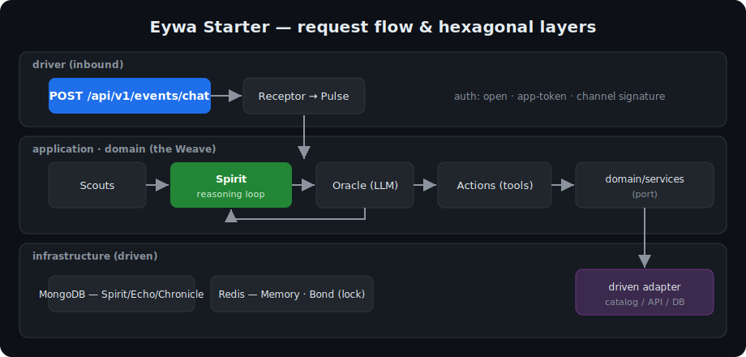

<h1 align="center">🌿 Eywa Starter</h1>

<p align="center">
  <em>Production-shaped, hexagonal template for building AI agents on <a href="https://github.com/wmulabs/eywa">Eywa</a> in Go.</em>
</p>

<p align="center">
  
  
  
  
</p>

> ▶️ **Click “Use this template”** (top of the page) to create your own repo, then follow the Quickstart.

A real, runnable agent — not a snippet. **What you get, already wired:** distributed locking,
conversation memory, an immutable audit log, a tool-calling reasoning loop, a token-protected
management API, and a clean hexagonal layout to grow into.

<p align="center">
  
</p>

> New to Eywa? The [`_examples/01_basic_setup`](https://github.com/wmulabs/eywa/tree/main/_examples/01_basic_setup) is the 20-line version. This starter is the structure you actually ship.

## Quickstart

```bash
make up                                 # MongoDB + Redis (Docker)
cp .env.example .env && $EDITOR .env    # set GEMINI_API_KEY
make run                                # starts the API on :8080
```

```bash
curl -s localhost:8080/api/v1/events/chat \
  -H 'Content-Type: application/json' \
  -d '{"user":"u1","message":"what analytics tools are in the catalog?"}' | jq
```

That's a full agent: distributed locking, conversation memory, an audit log, and a tool-calling
reasoning loop — already wired. It ships with two example tools (`get_time`, `catalog_lookup`) and a
Scout (`business_hours`); the catalog tool shows the **hexagonal flow** an Action →
`domain/services` port → `driven/catalog` adapter. The HTTP surface comes from Eywa's Fiber registrar.

<p align="center">
  
</p>

<sub>Regenerate with <code>vhs assets/demo.tape</code> (needs a live <code>GEMINI_API_KEY</code>).</sub>

**Open routes** (events are webhook-style — a channel or Cloud Tasks authenticates them, not a bearer token):

| Method & path | Purpose |
|---|---|
| `POST /api/v1/events/{key}` | process an event synchronously |
| `POST /api/v1/events/{key}/stream` | same, streamed over Server-Sent Events |
| `GET /health`, `/ready` | health checks |

**Management API** — token-protected, mounted only when `ADMIN_API_KEY` is set:

```bash
curl -s localhost:8080/api/v1/chronicle \
  -H "Authorization: Bearer $ADMIN_API_KEY" | jq      # audit log
# also: /api/v1/discovery, /api/v1/analytics/{tokens,actions,spirits}, /api/v1/echoes, /api/v1/app-tokens
```

One registrar (`eywafiber.RegisterRoutes`) mounts everything; management routes sit behind the API key.
Spirit CRUD is **not** exposed — Spirits live in code (`bootstrap/spirits.go`), so there's no open
prompt-injection surface. Wire more management groups (Vigil, Rites, config, SSE) via their repos in
`driver/rest/server.go`; swap the API key for operator JWT when you need human logins and roles.

**Authenticating events** (optional — open by default): mint a revocable **app token** via
`POST /api/v1/app-tokens` and set `REQUIRE_EVENT_TOKEN=true` so callers must send
`Authorization: Bearer <token>`; or verify channel signatures (Twilio / 360dialog) with `EventVerifiers`
(commented example in `driver/rest/server.go`). See
[docs/authentication.md](https://github.com/wmulabs/eywa/blob/main/docs/authentication.md).

## Layout

```
cmd/api/                          entrypoint — thin: bootstrap → start server → graceful shutdown
internal/
  application/                    your domain plugged into Eywa
    actions/                      tools: time_action.go, catalog_lookup_action.go (uses a domain port)
    scouts/                       context enrichment: business_hours_scout.go
    converters/                   Receptors: chat_receptor.go (payload → Pulse)
  domain/
    services/                     ports the actions depend on (catalog_service.go)
  infrastructure/
    bootstrap/                    wiring, one concern per file
      application.go              container: Initialize + Shutdown
      database.go · repositories.go · services.go   connections, Eywa repos, domain services
      engine.go                   builds the Weave; seeds Spirits; registers actions/scouts/converters/events
      actions.go · scouts.go · inbound_converters.go · events.go · spirits.go   registries + Links + seeds
    driven/catalog/               outbound adapter implementing CatalogService (in-memory stub)
    config/                       typed Config + Load()
    driver/rest/                  inbound HTTP — single RegisterRoutes (open events + authed management)
prompts/                          reference copies of Spirit prompts
deployments/  docker/  cloudbuild.yaml   ops
```

Mirrors Eywa's own hexagonal architecture: `application/` is your domain plugging into the library,
`domain/services/` are the ports, `infrastructure/driven/` are the outbound adapters, and `bootstrap/`
is the only place that knows how it all fits. An Action never imports a concrete adapter — only the port.

## Make it yours

| To… | Do |
|-----|----|
| Change the agent | edit the Spirit in `bootstrap/spirits.go` (prompt, model, allowed tools) |
| Add a simple tool | add an `eywa.Action` in `application/actions/` (copy `time_action.go`), register in `bootstrap/actions.go`, list it in `AllowedActions` |
| Add a tool that calls an API/DB | define a port in `domain/services/`, implement in `infrastructure/driven/`, wire in `bootstrap/services.go`, inject into the Action (copy `catalog_lookup_action.go`) |
| Add context enrichment | add a `Scout` in `application/scouts/`, register in `bootstrap/scouts.go`, opt in via `WithScouts(...)` on the Link |
| Add an agent / event | add a Spirit (`spirits.go`), a `Receptor` (`converters/` + `inbound_converters.go`), and a `Link` (`events.go`) |
| Authenticate events | `REQUIRE_EVENT_TOKEN=true` (app token) or `EventVerifiers` (channel signatures) in `driver/rest` |
| Turn on meta-cognition | builder options in `bootstrap/engine.go` — see [docs/reasoning.md](https://github.com/wmulabs/eywa/blob/main/docs/reasoning.md) |

## Deploy

```bash
docker build -f docker/Dockerfile -t eywa-starter .
docker run --env-file .env -p 8080:8080 eywa-starter
```

`cloudbuild.yaml` ships a Cloud Build → Cloud Run pipeline. Point `MONGO_URL` / `REDIS_URL` at managed
instances and inject secrets via Secret Manager in production.

## Learn more

- [Eywa repository](https://github.com/wmulabs/eywa) · [examples](https://github.com/wmulabs/eywa/tree/main/_examples) · [docs](https://github.com/wmulabs/eywa/tree/main/docs)
